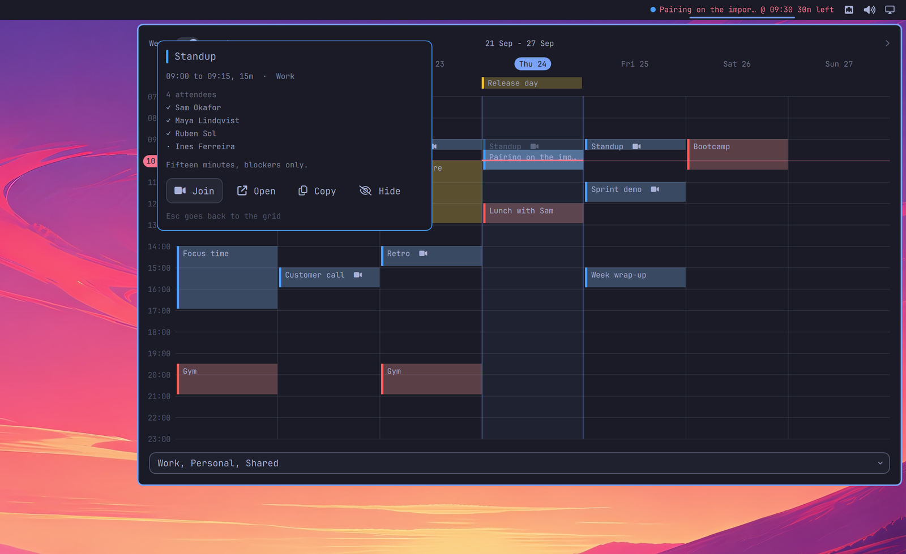

# Meetings

Your day as a column, with a line where you are in it.

Most calendar widgets answer one question: what is next. That is the least interesting thing your calendar knows. What you actually want to see is the shape of the day: where the meetings sit, where the gaps are, and whether the next two hours are yours or somebody else's. A list cannot show you that, because in a list an hour of nothing looks exactly like no time at all.

So this draws the whole day, or the whole week, the way a calendar does. Appointments sit at their place in time, a line marks now, and the space between two of them is real space.


And when the thing you are looking at is about to start, there is a button for it. No hunting for the link in the invite, no scrolling back through the thread it was in.

The bar stays quiet: one line with whatever is running or coming up, and how much time is left on it. No badge, nothing that moves.

## Install

```bash
omarchy plugin add https://github.com/jankeesvw/omarchy-meetings
omarchy plugin enable jankeesvw.meetings
omarchy bar move jankeesvw.meetings --section right
```

Google Calendar is the default provider. Its only requirement is [gcalcli](https://github.com/insanum/gcalcli), which is in the AUR. Because gcalcli is itself a Python program, the interpreter this plugin needs comes along with it.

```bash
yay -S gcalcli
```

## Google Calendar

Until gcalcli is authenticated the panel says so, and hands you the instructions rather than an error.


Two commands:

```bash
gcalcli init     # opens your browser once, asks for calendar access
gcalcli list     # should now print your calendars
```

`init` stores a token in `~/.local/share/gcalcli`. There is nothing to log into separately: this plugin runs gcalcli, and the attendee lookup borrows that same token. If you would rather use your own Google Cloud OAuth client, pass `--client-id` and `--client-secret` to `gcalcli init` and the rest works the same.

## Outlook and Microsoft Teams

Outlook works through [CLI for Microsoft 365](https://pnp.github.io/cli-microsoft365/). Install it and set the provider in `~/.config/omarchy-meetings/config.json`:

```bash
npm i -g @pnp/cli-microsoft365
```

```json
{ "provider": "microsoft" }
```

Set up the CLI with the minimal `User.Read` permission and choose scripting use:

```bash
m365 setup
```

In Microsoft Entra, add the delegated Microsoft Graph permission `Calendars.Read` to the app that `setup` created. Some work accounts need an administrator to approve it. Then sign in:

```bash
m365 login
m365 status --output json
```

The widget uses that login for Outlook. Teams links become the join button, and attendees are fetched only when you open an appointment.

The button in that panel copies a set of instructions to your clipboard, written to be handed straight to a coding agent if you would rather not do it yourself.


## iCalendar feeds

For an exported `.ics` file or a subscribed `https://`/`webcal://` feed, select
the iCalendar adapter and point it at the file or URL:

```json
{
  "provider": "ical",
  "icalPath": "webcal://example.com/private/calendar.ics"
}
```

No additional package or sign-in is required. UTC, numeric-offset and `TZID`
times are converted to local time, and daily or weekly recurring events are
expanded into the visible date range. Attendees travel with the agenda data, so
opening an appointment does not download a remote feed a second time.

## What you get

**The week, or one day.** The switch in the header decides, and it remembers what you picked. The day view narrows the panel to a single column and puts the start time in front of every appointment.


**Overlapping appointments side by side.** A focus block from nine to five with three meetings inside it shows all four, the way a calendar does, instead of hiding the short ones behind the long one.

**Getting into the call.** A meeting that is running, or starts within five minutes, puts a join button in the header. One click and you are in it. Outside that window the button is not there, so it never sends you into the wrong call.

**One appointment, opened.** Press Enter or click, and it expands into a card over the grid: when it is and how long it runs, which calendar it came from, where it is, who is coming and whether they answered, and the description. One button joins the video call, another opens it in the configured calendar. Escape goes back to the grid.



With Google, attendees do not come out of gcalcli's output, so they are fetched from the Calendar API by reusing gcalcli's token. With Microsoft, the widget asks Graph through `m365`. Either way, this happens only for the one appointment you opened and only at the moment you ask for it.

**How much room a gap really is.** Move the mouse into the space between two appointments and it hatches, with the span named in the middle. If that gap is running right now, it counts from this minute rather than from the end of the last meeting, because the part that has already passed is not time you still have.

**Which calendars you see.** The picker at the bottom lists your calendars by name. Untick the one full of other people's birthdays and it is gone from the grid, this week and every week after, until you tick it back.

**Everything from the keyboard.** Tab walks the switch, every appointment and the controls at the bottom. Arrows move between appointments and left and right page through days or weeks. Enter opens what you are on, Escape steps back out.

## Colours

Without a config every calendar is drawn in the same grey. Naming them is what makes a week readable at a glance, so write `~/.config/omarchy-meetings/config.json`:

```json
{
  "calendars": [
    { "match": "Work",     "color": "#4a9eff", "priority": 1 },
    { "match": "Personal", "color": "#ff5c5c", "priority": 2 },
    { "match": "Shared",   "color": "#f5c518", "priority": 3 }
  ]
}
```

For Outlook or iCalendar, keep the corresponding `"provider"` and iCalendar's
`"icalPath"` alongside the `calendars` key in that same object.

`match` is a regular expression, tried in order against the calendar name as the selected provider prints it. `priority` decides which appointment the bar picks when two run at once, lowest number first.

Three more keys are optional:

```json
{
  "skipCalendars": ["Birthdays"],
  "skipTitles": ["Out of office"],
  "borrowedCalendar": { "name": "Sam - Work", "label": "Sam's calendar" }
}
```

`skipCalendars` is only the starting position: it decides which calendars come unticked the first time you open the picker, and after that the picker is the answer. `skipTitles` drops appointments by name, which is useful for a standing block that would otherwise take a row every day. `borrowedCalendar` adds a toggle at the bottom that swaps your own day for a colleague's, for when you are looking for a slot in their week. Leave it out and the toggle is not drawn at all.

Changes are picked up on the next refresh, within a minute. No restart needed.

## Light themes


## Trying it without a calendar

The plugin can make up a week, which is useful before you set a provider up and for taking screenshots without your own appointments in them:

```json
{ "demo": true }
```

Or from the command line, leaving your config alone:

```bash
~/.config/omarchy/plugins/jankeesvw.meetings/bin/meetings-widget week --demo | jq
```

## The command line

The script behind the widget is worth something on its own:

```bash
cd ~/.config/omarchy/plugins/jankeesvw.meetings/bin

./meetings-widget day             # today as JSON
./meetings-widget day 1           # tomorrow, -1 is yesterday
./meetings-widget week            # Monday through Sunday
./meetings-widget calendars       # your calendar names
./meetings-widget attendees "Work" <event-id>
```

Every appointment carries its start and end, its duration in minutes, the calendar it came from, its colour, its location, its description and its links. Which makes `./meetings-widget week | jq '[.days[].events[]] | length'` a fair answer to how bad next week is.

The command reads the provider from `config.json`; `MEETINGS_PROVIDER=microsoft`
or `MEETINGS_PROVIDER=ical MEETINGS_ICAL_PATH=/path/to/calendar.ics` overrides
it for one invocation.

## Removing it

```bash
omarchy plugin remove jankeesvw.meetings
```

That leaves three files behind, all of which you can delete by hand:

- `~/.config/omarchy-meetings/config.json`, your provider, colours and filters. Holds the names of your calendars, and the name of the colleague whose calendar you can borrow if you configured one.
- `~/.config/omarchy-meetings/state.json`, which calendars you ticked and whether you left it on the week or the day. Calendar names again.
- `~/.cache/omarchy-meetings/calendars.json`, the provider plus calendar names and ids, kept for an hour so the widget does not ask the provider every minute.

No appointments are ever written to disk. Titles, attendees and descriptions are read fresh each time the panel refreshes and are gone when the shell stops, so what survives a removal is those three files and nothing about your actual days. gcalcli keeps its credentials in `~/.local/share/gcalcli`; CLI for Microsoft 365 keeps its own connection data separately. Neither belongs to this plugin, so removing the plugin does not sign either provider out.

## Licence

MIT. See [LICENSE](LICENSE).
